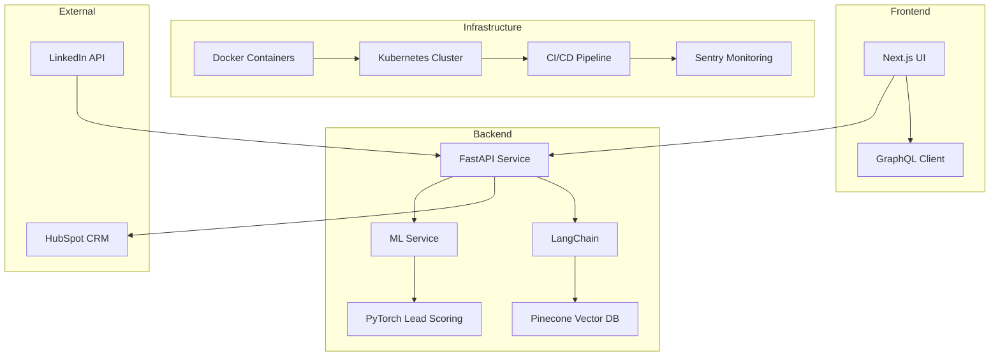

# PitchPal

A modern, containerized AI-powered cold email personalization platform with automated CI/CD and CRM integration.

## Features

- **AI-Driven Personalization**: Create ultra-tailored cold emails based on recipient data from LinkedIn and other sources
- **Lead Scoring**: PyTorch ML model for prioritizing promising prospects
- **RAG-Powered Context**: Use Retrieval Augmented Generation to craft cold emails with deep personalization
- **HubSpot CRM Integration**: Push generated cold emails directly to your CRM
- **Modern DevOps**: Containerized architecture with Kubernetes orchestration and automated deployments

## Architecture



## Tech Stack

- **Frontend**: Next.js + TypeScript + React
- **Backend**: FastAPI (Python)
- **AI & ML**: 
  - LangChain for RAG implementation
  - PyTorch for lead scoring
- **Data Storage**: 
  - Pinecone for vector embedding storage
  - PostgreSQL for relational data
- **Infrastructure**: 
  - Docker + Kubernetes
  - Terraform for IaC
  - GitHub Actions for CI/CD
- **Monitoring**: Sentry
- **Integration**: HubSpot API

## Getting Started

### Local Development

1. Clone this repository
2. Install dependencies:
   ```
   # Backend
   cd services/api_service
   pip install -r requirements.txt
   
   # Frontend
   cd frontend/next-app
   npm install
   ```
3. Configure environment variables in `.env.local`
4. Start services:
   ```
   # Using Docker Compose
   docker-compose up -d
   
   # Or run services individually
   cd services/api_service
   uvicorn main:app --reload
   
   cd frontend/next-app
   npm run dev
   ```

### Deployment

```bash
# Initialize Terraform
cd infrastructure/terraform
terraform init
terraform apply

# Deploy to Kubernetes
cd infrastructure/k8s
kubectl apply -f .
```

## Project Structure

```
ColdEmailIO/
├── services/            # Microservices
│   ├── api_service/     # FastAPI backend
│   ├── ml_service/      # PyTorch lead scoring service
│   └── vector_service/  # Vector DB integration service
├── infrastructure/      # Infrastructure as Code
│   ├── terraform/       # Terraform configuration
│   ├── k8s/             # Kubernetes manifests
│   └── docker/          # Dockerfiles
├── frontend/            # Next.js frontend
│   └── next-app/        # Next.js application
├── .github/             # GitHub Actions workflows
└── README.md            # Project documentation
```
